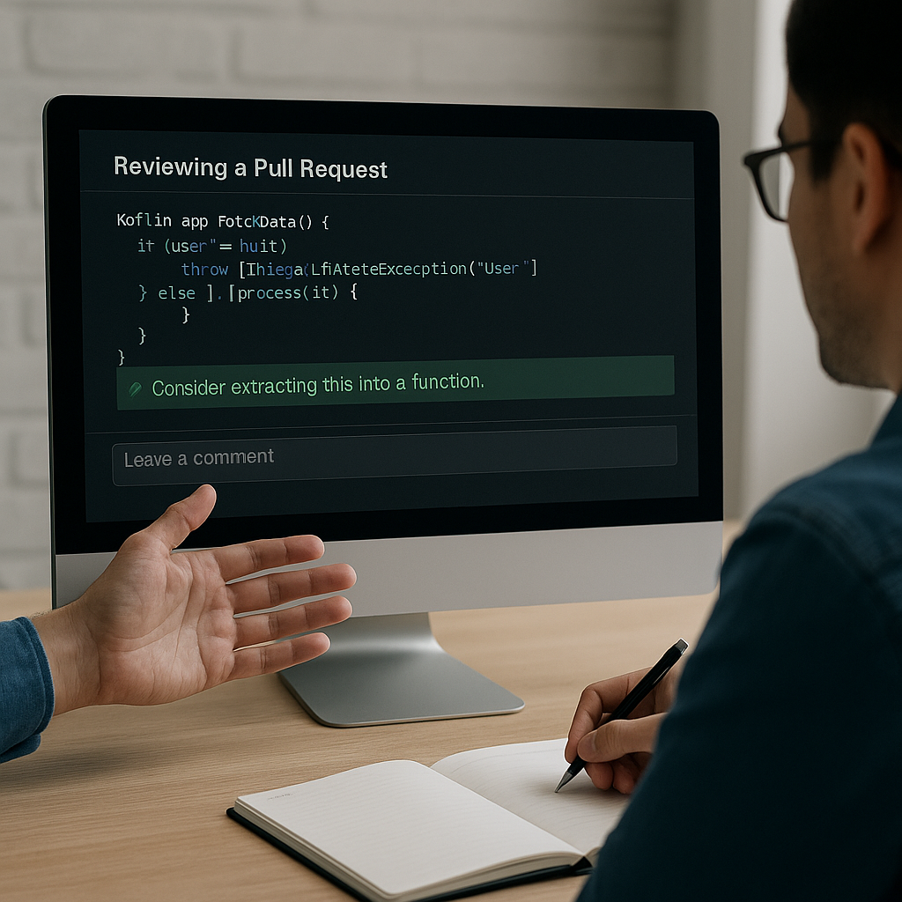

# How to Do a Code Review Effectively



Code review is more than just a technical ritual. It’s a communication process — one that strengthens the foundation of a software project and enhances the skills of everyone involved. Whether you are a junior developer submitting your first pull request or a senior engineer maintaining quality standards, knowing how to conduct a code review effectively is a key professional skill.

## What Is a Code Review?

A code review is a systematic examination of source code written by another developer, usually before merging it into the main branch. The goal isn’t to find fault but to ensure quality, maintain consistency, and share knowledge.

Most teams use pull requests (PRs) in GitHub, GitLab, or Bitbucket to facilitate reviews. The reviewer checks not only for correctness but also for readability, maintainability, and adherence to project standards.

## Why Code Reviews Matter

A good review acts as a safety net and a mentorship tool simultaneously.

Some key benefits include:

- Error Prevention: Early detection of bugs, logic flaws, or missing edge cases.
- Knowledge Sharing: Developers learn different patterns and approaches from each other.
- Consistency: The codebase reflects the same design principles and conventions.
- Team Trust: Review discussions foster respect and collaboration rather than isolation.

> 💡 Example: During a review, one developer might suggest replacing nested loops with a Kotlin mapNotNull to simplify logic and improve performance.

## Preparing for a Review (Checklist)

Before reviewing code, context matters. You should understand why the change was made and what it aims to solve.

A quick checklist:

- Read the Description: Ensure the pull request includes a clear summary and relevant issue links.
- Run the Code (if possible): Test locally or in a staging environment.
- Check the Diff Size: Focus reviews on manageable chunks — large PRs often hide small but important issues.
- Align with Style Guides: Follow the team’s formatting and naming conventions.

> Example: Before commenting on performance, confirm that the change truly affects runtime-critical paths.

## How to Review Code Step-by-Step

A structured approach helps maintain objectivity:

1. Start with the Big Picture: Does the change make sense architecturally?
2. Evaluate Logic Flow: Are edge cases handled? Is there unnecessary complexity?
3. Check Naming and Clarity: Can another developer understand this code in a week?
4. Review Tests: Are there adequate unit/integration tests?
5. Assess Error Handling: Exceptions, nulls, and fallback scenarios — all must be considered.

Example:

```kt
if (user == null) {
    throw IllegalStateException("User must not be null")
}
```

Instead of hard exceptions, reviewers might suggest:

```kt
user?.let { process(it) } ?: logger.warn("Missing user data")
```

## Common Mistakes and How to Avoid Them

Even experienced reviewers fall into traps:

- Nitpicking: Focus on logic and maintainability first, not indentation.
- Rushing Reviews: Speeding through leads to shallow checks.
- Personal Bias: Different coding styles aren’t necessarily wrong — focus on standards, not preferences.
- Ignoring Tests: Every review should confirm that testing is robust and meaningful.

> ✅ Tip: Automate stylistic checks using linters and CI tools so humans can focus on logic and design.

## Writing Constructive Feedback

The tone of your feedback can define team morale. Keep comments:

- Specific: “Consider extracting this into a function” is better than “This is messy.”
- Actionable: Suggest clear alternatives or examples.
- Respectful: Assume good intent; remember there’s a human behind every PR.
- Balanced: Acknowledge good ideas, not only flaws.

> Example:
“Nice use of Kotlin coroutines here — could you also add a timeout to prevent hanging jobs?”

## Balancing Speed and Quality

A common challenge in modern development is balancing rapid releases with thorough reviews.

To maintain both:

- Set clear review deadlines (e.g., within 24 hours).
- Prioritize critical logic changes over trivial refactors.
- Use labels like “needs tests” or “ready for merge” to track review status.
- Pair-review major architectural changes for deeper analysis.

Automation can handle repetitive checks, leaving humans to focus on judgment and design decisions.

## Real-world Example: Reviewing a Pull Request

Imagine a developer submits a PR that optimizes a database query in a Kotlin Spring Boot service.

- The reviewer first ensures the logic returns identical results.
- Then checks if indexes are properly used.
- Notes that the method name `fetchData()` could be more descriptive — perhaps `findActiveUsers()`.
- Suggests adding a test for cases when the query returns an empty list.

Approves with a minor comment:

> “Good optimization! Just make sure to document the new query behavior in the README.”

This kind of review not only improves the code but also builds a learning moment for both sides.

## Conclusion

Effective code reviews are less about control and more about collaboration. They create a shared sense of ownership and keep the codebase reliable as the team scales.
When done thoughtfully, code reviews become a quiet teacher — guiding developers toward clarity, empathy, and technical excellence.

> “Don’t just review code; review thinking.”

A culture of mutual respect and curiosity will always lead to better software — and better engineers.
